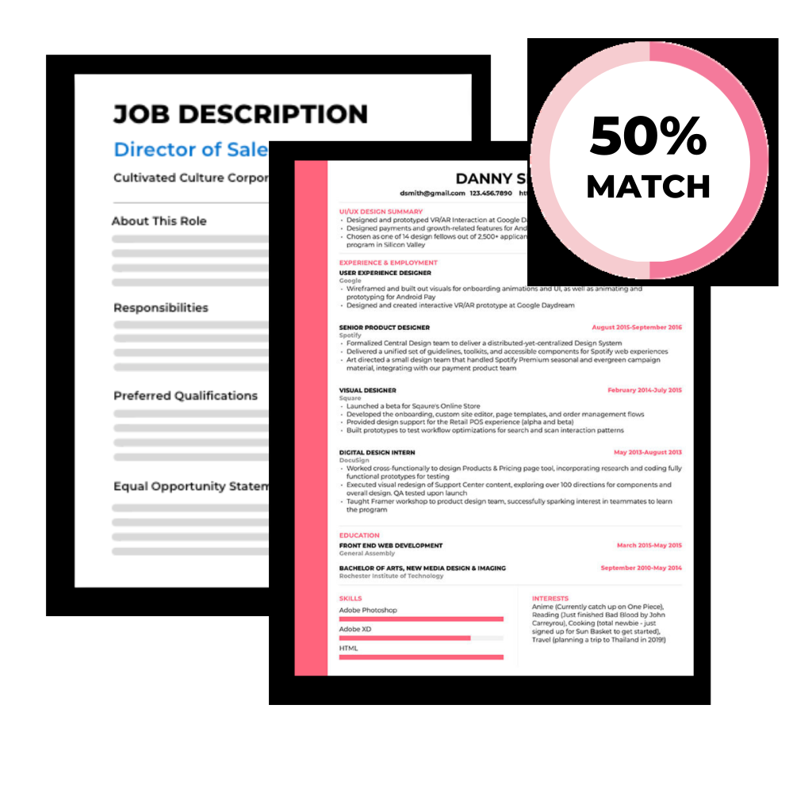

# **Automated Resume Screening & Job Match Finder**

Welcome to the Automated Resume Screening & Job Match Finder repository. This project leverages a fine-tuned BERT model to analyze resumes and match them with job descriptions or suggest suitable job roles based on the resume content alone.

---

<div align="center">
  
</div>

---

## 🚀 **Overview**

This project uses BERT-based embeddings to classify and rank candidates based on job descriptions or suggest job roles for a resume-only scenario. The system includes a Flask backend, an interactive frontend, and is designed to process both PDF and text files. The application is containerized with Docker for easy deployment on platforms like Render.

---

## ✨ **Features**

- **Resume + Job Description Matching**: Analyzes both a resume and a job description to rank the candidate's suitability for the role.
- **Resume-only Role Suggestion**: Suggests appropriate job domains based solely on the resume.
- **User Interface**: Intuitive and dynamic frontend where users can upload documents and view results in an organized manner.
- **Backend with Flask**: A simple and effective backend that handles requests, processes documents, and returns results.
- **Dockerized Deployment**: The project is containerized using Docker, making it easy to deploy on any cloud platform.

---

## 📂 **Contents**

- `main.py`: Flask backend responsible for handling user inputs, resume/job description uploads, and returning ranking or job role suggestions.
- `app/bert_model.pth`: Fine-tuned BERT model weights for resume and job description matching.
- `app/bert_tokenizer.pkl`: Tokenizer for BERT model used in text embedding generation.
- `templates/index.html`: Main frontend interface for file uploads and displaying results.
- `static/style.css`: Custom CSS for styling the interface with a colorful and attractive layout.
- `static/app.js`: JavaScript for dynamic behavior, enabling file uploads and interaction with the Flask backend.
- `candidate_embeddings_generator.py`: Python script to generate candidate embeddings and categories for ranking and job matching.
- `candidate_rankings.pkl`: Pre-generated candidate rankings for efficient real-time results.
- `candidate_categories.pkl`: Pre-generated job domain embeddings for role suggestions based on resumes.
- `requirements.txt`: List of Python dependencies required to run the project.
- `Dockerfile`: Configuration for containerizing and deploying the project on platforms like Render.

---

## 🛠️  **Getting Started**

1. **Clone the Repository**:
   ```bash
   git clone https://github.com/your_username/Automated-Resume-Screening-and-Job-Match-Finder.git
   cd Automated-Resume-Screening-and-Job-Match-Finder
   
2. **Install the required packages**:
   Ensure you have Python 3.x installed. Install dependencies by running:
   ```bash
   pip install -r requirements.txt

3. **Generate Candidate Embeddings and Categories**:
   Run the script to generate the required `.pkl` files for candidate embeddings and categories:   
   ```bash
   python3 app/candidate_embeddings_generator.py

4. **Run the Flask App**:
   To start the web app locally:
   ```bash
   python3 app.py
   Open your web browser and go to `http://127.0.0.1:5000/`

---

## 📈 **Model Training and Development**

- The `model_development.ipynb` notebook contains the code used for training and fine-tuning the **BERT Model** for resume classification.
- The model utilizes BERT embeddings to understand the relationship between job descriptions and resumes, as well as infer job roles from resumes.
- The model files (`bert_model.pth` and `bert_tokenizer.pkl`) are pre-trained and loaded during inference.

---

## 🔍 **Key Insights**

- The project uses a fine-tuned **BERT Model** to process resume and job description data.
- The frontend allows users to upload files and receive results dynamically, making it easy to match candidates or suggest roles.
- Embeddings for resumes and job descriptions are generated and stored for quick access during inference.
- The application is designed to be deployed in a containerized environment using Docker.

---

## 🛠️ **Tools and Libraries**

- `Flask`: For the web backend.
- `PyTorch`: For loading and running the BERT model.
- `Transformers`: Hugging Face library for fine-tuning and inference.
- `PyPDF2 & pdfminer.six`: For extracting text from PDFs.
- `HTML, CSS, JavaScript`: For creating the frontend interface.
- `Docker`: For containerizing the entire application.
- `Jupyter Notebook`: For developing and fine-tuning the BERT model.

---

## 🤝 **Contributing**

If you have suggestions or improvements, feel free to open an issue or create a pull request.

---
## ⭐ **Thank You!**

Thank you for visiting! If you find this project useful, please consider starring the repository. Happy coding!

